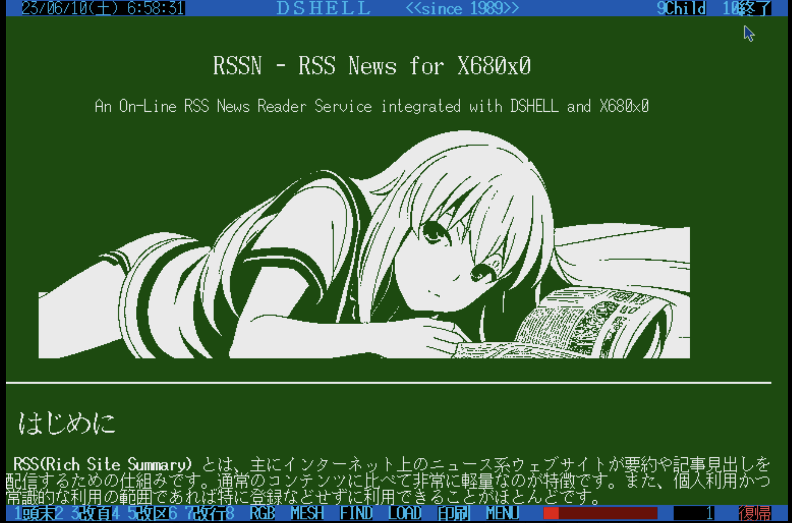

# RSSN.X

RSS News Reader for X680x0/Human68k

---

# About This

`RSSN.X` は、X680x0/Human68k 上で動作する、RSS News リーダーです。往年のパソコン通信BBS用オフラインログリーダーライクなUIを持ちながらも、オンラインで68側で指定したサイトのRSSフィードをブラウズすることが可能です。

ただし、中継用にミニサーバ `rssnd` を68の外で動かす必要があります。これは Python で書かれており、Raspberry Piを含むLinux、macOS、Windowsなどの環境で動作させることができます。

`RSSN.X` は `rssnd` とRS232Cクロスで接続し通信を行います。

---

# ハードウェアの準備

`RSSN.X` を動かすX680x0実機と `rssnd` サーバを接続するために以下のケーブルを使います。

1. RS232C 25pin オス - 9pin メス クロスケーブル

[SANWA SUPPLY KRS-423XF-07K](https://amazon.co.jp/dp/B00008BBFQ) など、現在でも新品で購入可能です。ストレートケーブルと間違わないように。

2. RS232C 9pin オス - USB 変換ケーブル

相性問題の出にくい[FTDI製チップセットを使ったもの](https://amazon.co.jp/dp/B07589ZF9X)を個人的にはお勧めします。

必要に応じてさらに USB TypeA - TypeC ケーブルなどを追加してください。

---