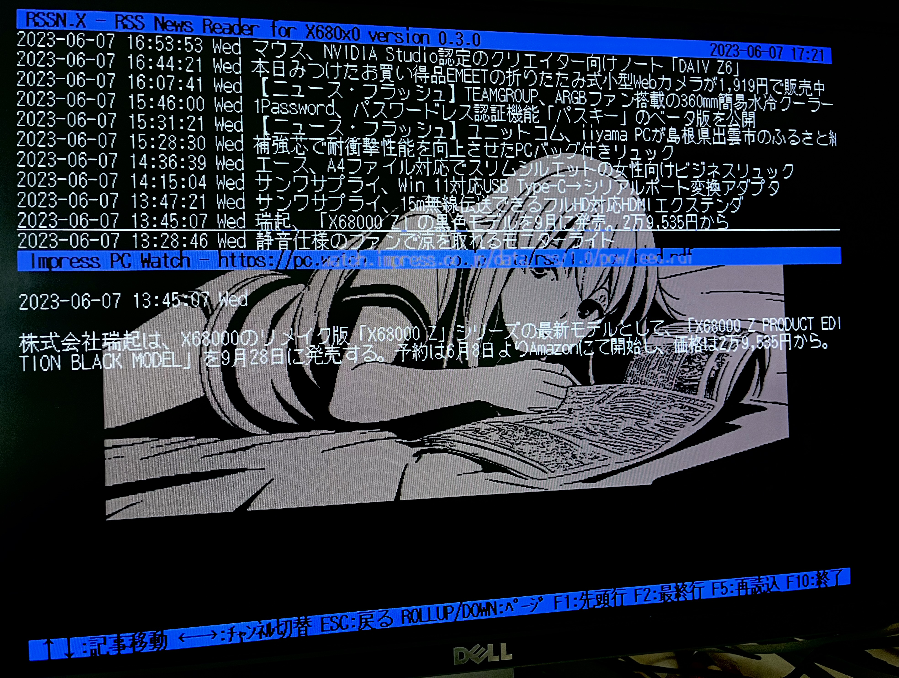

# RSSN.X

RSS News Reader for X680x0/Human68k

---

# About This

情報過多と言われるこの時代、エッセンスのみが抽出されたRSSで素早く多彩な情報をキャッチしてみませんか。

RSSN.X は、X680x0/Human68k 上で動作する、RSS News リーダーアプリケーションです。往年のパソコン通信BBS用オフラインログリーダーライクなUIを持ちながらも、68側から指定したサイトのRSSフィードをオンラインでブラウズすることが可能です。

- RSSサイト定義ファイルサンプル同梱
- emacs/vi風キーバインドで手に馴染むキーボード操作
- ハイメモリ対応(使える状況にあれば自動的に使います)
- 38400bps高速通信対応(要TMSIO.X)
- CUTファイル対応(要CUT.R)
- X68000Z対応

ただし注意点として、データ中継用にミニサーバ `rssnd` を68の外で同時に動かしておく必要があります。`rssnd`は Python で書かれており、Raspberry Piを含むLinux、macOS、Windowsなどの環境で動作させることができます。

以下は X68000XVI 実機と Raspberry Pi 4B を使った動作確認環境の構成例です。

RSSN.X は `rssnd` とRS232Cクロスで接続し通信を行います。(通信速度は設定可能です)

---

# ハードウェアの準備

RSSN.X を動かすX680x0実機と `rssnd` サーバ機を接続するために以下のケーブルを使います。

1. RS232C 25pin オス - 9pin メス クロスケーブル

[SANWA SUPPLY KRS-423XF-07K](https://amazon.co.jp/dp/B00008BBFQ) など、現在でも新品で購入可能です。ストレートケーブルと間違わないように気をつけてください。

2. RS232C 9pin オス - USB 変換ケーブル

相性問題の出にくい[FTDI製チップセットを使ったもの](https://amazon.co.jp/dp/B07589ZF9X)を個人的にはお勧めします。

必要に応じてさらに USB TypeA - TypeC ケーブルなどを追加してください。

X68000Z と Raspberry Pi の組み合わせにおいては、UART端子同士を直結することが可能ですが、安定して 38400bps の通信を行うためには UART - USB 変換ケーブルを使うことをお勧めします。(UART:X68Z, USB:RasPi)

---

# rssnd サーバのセットアップ

## Raspbery Pi (Linux)

gitをインストール

    sudo apt install git

rssndをインストール(pipがなければpip3を使う)

    pip install git+https://github.com/tantanGH/rssn.git

動作確認

    rssnd --help

USB-Serialケーブルを挿した状態で、デバイスの存在を確認

    ls -alF /dev/ttyUSB*

rssnd起動

    rssnd -d /dev/ttyUSB0 -s 38400 -v

停止するにはCTRL+Cを押すかkillしてください。

## macOS

[Homebrew](https://brew.sh/)をインストール

gitをインストール

    brew install git

rssndをインストール(pipがなければpip3を使う)

    pip install git+https://github.com/tantanGH/rssn.git

動作確認

    rssnd --help

USB-Serialケーブルを挿した状態で、デバイスの存在を確認

    ls -alF /dev/tty.usb*

rssn起動

    rssn -d /dev/tty.usbserial-xxxx -s 38400 -v

停止するにはCTRL+Cを押すかkillしてください。

## Windows

[Windowsユーザ向けPython導入ガイド](https://github.com/tantanGH/distribution/blob/main/windows_python_for_x68k.md) に従って Python, git を導入

rssndをインストール

    pip install git+https://github.com/tantanGH/rssn.git

動作確認

    rssnd --help

USB - Serial ケーブルを挿し、コントロールパネルで COM1 として使えるようにしておく。(ケーブル付属のマニュアルなど参照)

起動

    rssnd -d COM1 -s 38400 -v

停止するにはCTRL+Cを押してください。

---

# RSSN.X のセットアップ

RSSNxxx.ZIP をダウンロードし、テンポラリディレクトリに展開する。

- RSSN.X ... 実行ファイル。パスの通ったディレクトリに置く。
- RSSN.DEF ... デフォルトのRSSサイト定義ファイル
- RSSN.CUT ... CUTファイルのサンプル

TMSIO.X

CUT.R

USB - RS232C クロスケーブルが接続された状態で、

---

# 使い方

---

# RSSサイトリストの編集

---

# CUTファイルの利用

---

# Special Thanks

---

# 更新履歴
