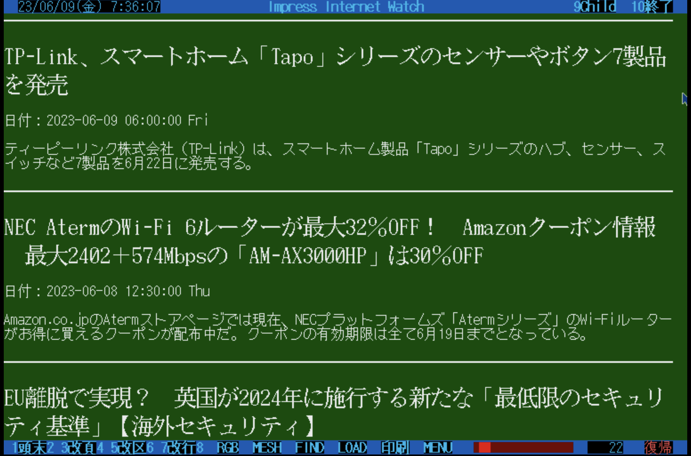
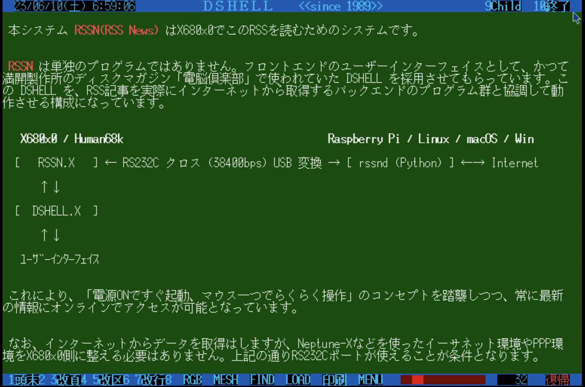

# RSSN

RSS News Reader System for X680x0/Human68k

---

## About This

情報過多と言われるこの時代、エッセンスのみが抽出されたRSSで素早く多彩な情報をキャッチしてみませんか。

RSSN は、X680x0/Human68k 上で動作する、RSS News Reader Systemです。

- 高速38400bps常時接続
- X680x0側にイーサネット環境不要
- ユーザーインターフェイスとして電脳倶楽部のDSHELLを採用(すいません)
- あらかじめ実績のあるいくつかのRSSサイトを定義済み
- X68000Z対応

 
 

ただし注意点として、データ中継用にミニサーバ `rssnd` を68の外で同時に動かしておく必要があります。`rssnd` は Python で書かれており、Raspberry Piを含むLinux、macOS、Windowsなどの環境で動作させることができます。

以下での動作を確認しています。

- X68030/060turbo(50MHz) + M1 MacBook Air
- X68000XVI(16MHz) + Raspberry Pi 4B
- X68000Z(10MHz) + Raspberry Pi 4B

---

## インストール方法

あらかじめ電脳倶楽部に添付されていた DSHELL.X を用意しておく必要があります。もし持っていない場合は、下のZ用XDFの中に含めてありますので、そちらから取得するなどしてください。

また、COMMAND.X にパスを通しておいてください。

RSSNxxx.ZIP をダウンロードし、新規ディレクトリに展開する。

- RSSN.X ... 実行ファイル
- RSSN.CUT ... CUTファイル
- INDEX.DOC ... メインDOCファイル兼RSSサイト定義ファイル
- SETUP.DOC ... セットアップガイド(実機用)
- SETUPZ.DOC ... セットアップガイド(Z用)

展開したディレクトリに移動し、

        dshell index.doc

で起動します。サーバやケーブル接続に関するセットアップの詳細はそちらを参照してください。

---

## X68000Z 用起動XDFイメージ

X68000Z の場合はこちらの起動用XDFを使うと既に構成済みですので手軽です。

[X68Z_RSSN_20230616.XDF](https://github.com/tantanGH/rssn/raw/main/X68Z_RSSN_20230616.XDF)

---

## Special Thanks

- DSHELL.X 開発者の方々 ... かっちんさん, BEEPsさん, 満開製作所さん, Hoppieさん, T.Murataさん

異なるフォントサイズの混在、エスケープシーケンス、画像埋め込み、マウス操作、検索、リンク対応、外部プロセス呼び出しなど、ブラウザとしての基本要件を既に30年以上前に確立していた上に拡張性を残しておいてくださった素晴らしいソフトウェアのDSHELLを、一方的ながら今回活用させて頂くことにしました。この場を借りてお礼申し上げます。

なお、配布されていたDSHELLのオリジナルアーカイブによれば、転載自由とのことで今回リポジトリとXDFに含めさせて頂いています。
ただ手元のバージョンはおそらく古いので、もしバージョン3.3x以上の配布アーカイブをお持ちの方がいましたらご連絡頂けると助かります。

---

## 更新履歴

RSSN.X 及び関連ファイル:

* 0.5.4 (2023/07/11) ... 時刻合わせオプション -t 追加
* 0.5.3 (2023/06/16) ... 環境変数 RSSN_QUIET, RSSN_STDOUT 追加
* 0.5.2 (2023/06/15) ... DOCファイル一部修正, XDF更新
* 0.5.0 (2023/06/10) ... 初版

rssnd:

* 0.5.4 (2023/07/11) ... 時刻問い合わせAPI追加
* 0.5.2 (2023/06/15) ... Windowsの環境によってはHTTPSサイトとの通信に失敗していたのを修正
* 0.5.1 (2023/06/14) ... 記事タイトルにSJISに変換できないコードがあるとabortしていたのを修正
* 0.5.0 (2023/06/10) ... 初版
